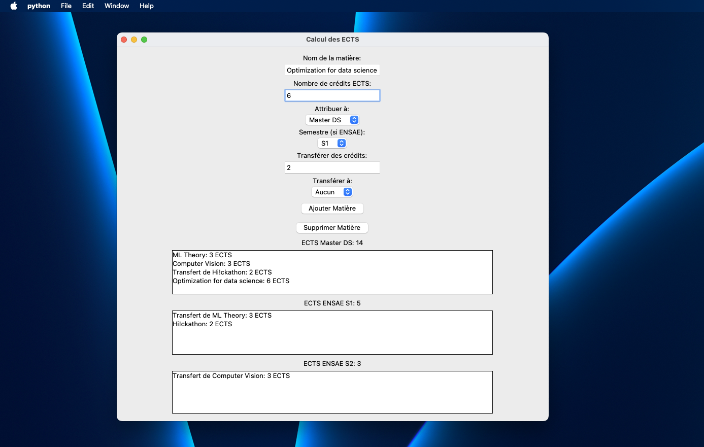

# Course Selection Interface for Ensae / M2DS

This repository contains a **simple user interface** built with **Tkinter** that allows students to select courses for their dual degree program. The interface is designed to help users choose subjects based on specific criteria, including **ECTS credits** and other requirements for the program.

## Features
- **Course Selection**: Users can browse and select courses based on dual degree requirements.
- **ECTS Calculation**: Displays and calculates total ECTS credits to ensure all criteria are met.
- **User-Friendly Interface**: Built with Tkinter for a straightforward, easy-to-navigate experience.

## Requirements
- Python 3.11
- Tkinter (usually included with Python)

## How to Run
1. Clone this repository.
2. Run the main script:
   ```bash
   python main.py
   
 
